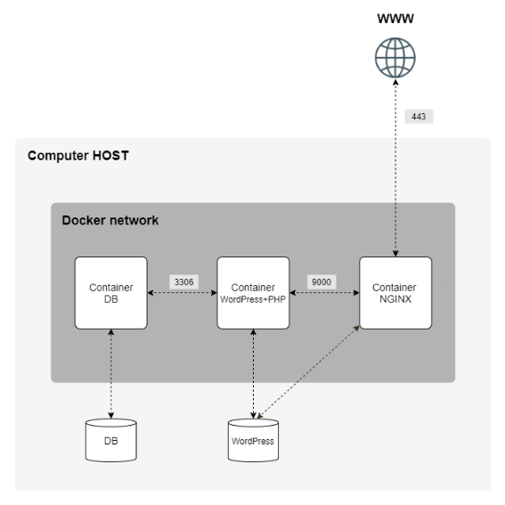

# **INCEPTION**

*Ce projet a été créé dans le cadre du programme de formation de 42 par pbret.*

## **DESCRIPTION DU PROJET**

Inception consiste à construire une petite infrastructure web composée de trois services, chacun dans son propre conteneur Docker, orchestrés par Docker Compose.
Chaque conteneur est construit avec le systeme d'exploitation Debian(sans le noyeu).

    1. NGINX     -> le serveur web
    2. WORDPRESS -> le CMS (Content Management System), exécuté via PHP-FPM (FastCGI Processus Manager)
    3. MARIADB   -> la base de données

## **NOTIONS**

### **Machine virtuelle VS Conteneur Docker**

**Machine virtuelle**  
Une machine virtuelle émule un ordinateur complet. Grâce à un hyperviseur(VBox, UTM), elle fait tourner son propre système d'exploitation complet avec son propre noyau. Chaque VM embarque donc un OS entier.

**Conteneur Docker**  
Un conteneur Docker est une façon d'isoler une application(service) et tout ce dont elle a besoin pour fonctionner(dependences), sans avoir à embarquer un système d'exploitation complet.  
Quand on construit un conteneur, on installe bien les fichiers du système : les programmes, les commandes (apt, bash...), les bibliothèques. Mais on n'installe pas le noyau. Le conteneur utilise directement le noyau de la machine hôte, qu'il partage avec tous les autres conteneurs et la machine hote.

| Critère | Machine virtuelle | Conteneur Docker |
|---|---|---|
| Noyau | le sien (OS complet) | partagé avec l'hôte |
| Poids | lourd (plusieurs Go) | léger (quelques Mo) |
| Démarrage | lent | quasi instantané |
| Ressources allouées | élevées | faibles |
| Isolation | très forte | plus faible |
| Choix de l'OS | n'importe lequel | même noyau que l'hôte |
| Portabilité | lourde à déplacer | image légère, facile à partager |

### **La gestion du .env**  
Le fichier .env regroupe les variables d'environnement du projet, notamment des données sensibles. Il se situe à la racine du projet et il est ajouté au .gitignore par sécurité. Docker Compose, via la directive `env_file`, les injecte dans les conteneurs.

### **Réseaux Docker**  

Docker propose deux modes de réseau :

- *Réseau hôte* : le conteneur partage directement ses ports avec ceux de l'hôte. Pas d'isolation.
- *Réseau Docker (bridge)* : Docker crée un réseau virtuel privé dans lequel les conteneurs sont isolés. Ils communiquent entre eux par leur nom de service, tout en restant invisibles depuis l'extérieur.  
  

### **Volumes Docker**  

Un conteneur est éphémère. Tout ce qu'il contient disparaît lorsqu'il est supprimé. Pour une base de données comme MariaDB, ce serait un problème majeur. Chaque reconstruction du conteneur effacerait toutes les données.  
Les volumes résolvent ce problème en stockant les données **en dehors** du conteneur, directement sur la machine hôte. Ainsi, les données survivent à l'arrêt, à la suppression et à la reconstruction du conteneur.  
C'est ce qu'on appelle **la persistance**.

**Persistance des données**  
Il y a deux possibilités pour gérer la persistance des données:  

- **Volume Docker**:  Docker gère lui-même le stockage, dans son propre répertoire sur l'hôte.  

- **montages liés**:  Tu lies un répertoire précis de l'hôte a un répertoire précis dans le conteneur. Un peu comme un lien symbolique mais ce n'est pas la même chose non plus.  

| | Volume Docker | Montage lié (bind mount) |
|---|---|---|
| **Emplacement** | géré par Docker | choisi par l'utilisateur |
| **Avantage** | simple, automatique, portable | accès direct aux données, contrôle de l'emplacement |
| **Inconvénient** | données moins accessibles | dépend du chemin de l'hôte, le répertoire doit exister |

La gestion des volumes se définit dans le fichier `docker-compose.yml`.

### **PHP-FPM**

NGINX ne sait pas exécuter du PHP lui-même : il délègue cette tâche à **PHP-FPM** (PHP FastCGI Process Manager).  
PHP-FPM est un service qui maintient en permanence un ensemble de processus PHP prêts à travailler. Quand NGINX reçoit une requête PHP, il la transmet à PHP-FPM via le protocole FastCGI (sur le port 9000). PHP-FPM exécute alors le code, interroge MariaDB si besoin, et renvoie le HTML généré à NGINX, qui le transmet au navigateur.

## INSTRUCTIONS

### Prérequis

- Docker et Docker Compose
- Ajouter le domaine dans le fichier `/etc/hosts` de la machine hôte : 127.0.0.1   pbret.42.fr
- Les dossiers suivants doivent exister sur l'hôte (ils contiennent les volumes et le fichier `.env`) :  
*/home/pbret/data/mariadb*  
*/home/pbret/data/wordpress*  
*/home/pbret/data/.env*  

Le fichier `.env` (identifiants base de données, comptes WordPress, domaine) est stocké dans `/home/pbret/data/` et exclu du dépôt via `.gitignore`.  
Le Makefile le copie automatiquement dans `srcs/` au lancement.

### Installation et lancement

- git clone <url_du_depot>
- cd inception
- make

La commande `make` copie le `.env` dans `srcs/`, construit les images et
démarre les trois conteneurs.

### Commandes Makefile disponibles

| Commande     | Action                                                        |
|--------------|---------------------------------------------------------------|
| `make`       | Copie le `.env`, build les images et démarre les conteneurs   |
| `make down`  | Arrête et supprime les conteneurs et le réseau                |
| `make stop`  | Arrête les conteneurs sans les supprimer                      |
| `make start` | Redémarre les conteneurs arrêtés                              |
| `make re`    | Reconstruit tout (`down` puis `up`)                           |
| `make clean` | Arrête tout, nettoie Docker et supprime les volumes et données|

### Accès

Une fois les conteneurs démarrés, ouvrir un navigateur et aller sur : https://pbret.42.fr

Le tableau de bord d'administration WordPress est accessible via : https://pbret.42.fr/wp-admin

Un avertissement de sécurité s'affiche car le certificat SSL est auto-signé.  
C'est normal -> il faut accepter pour accéder au site.

## RESSOURCES

- Tutoriel Inception — https://tuto.grademe.fr/inception/
- Playlist YouTube sur Inception — https://www.youtube.com/watch?v=EfIed-cFms4&list=PLpLG--nxBMd-wO_MAWh3gzqCcFh4qNMvP
- Vidéo YouTube explicative — https://www.youtube.com/watch?v=mspEJzb8LC4
- Documentation officielle Docker — https://docs.docker.com/
- L'IA a été utilisée comme outil d'apprentissage et de support tout au long du projet, notamment pour :  
    *Comprendre les concepts*  
    *Relire et expliquer les fichiers de configuration*  
    *Déboguer les erreurs*  
    *Réviser les Dockerfiles, le docker-compose et le Makefile*  
- L'aide de mon ami **Paul `phautena`** : Il a su me guider tout au long de mon projet. Un vrai mec en or. https://profile.intra.42.fr/users/phautena

